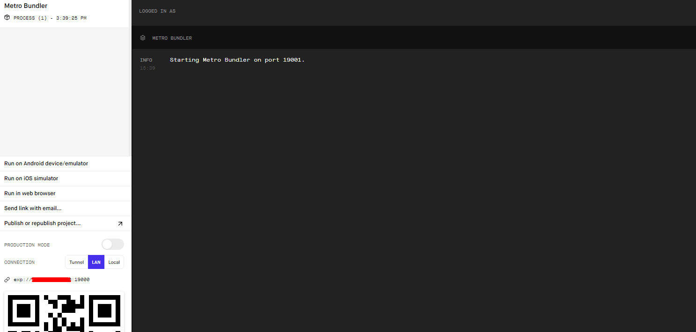

<p  align="center"></img></p>

<p align="center">
  <image 
  src="https://img.shields.io/github/languages/count/JCDMeira/Proffy"
  />
  <image 
  src="https://img.shields.io/github/languages/top/JCDMeira/Proffy" 
  />
  <image 
  src="https://img.shields.io/github/last-commit/JCDMeira/Proffy" 
  />
  <image 
  src="https://img.shields.io/github/watchers/JCDMeira/Proffy?style=social" 
  />
</p>

# 📋 Indíce 
- [RocketSeat](#id01)
  - [Next Level Week](#id02)
  - [Instrutores](#id03)
- [Proffy](#id04)
  - [Tecnologias utilizadas](#id05)
- [Como usar esse projeto](#id06)
  - [Pré-requisitos](#id07)
  - [Procedimentos de instalação](#id08)
- [Telas](#id9)
- [Meios de contato](#id10)

# 🚀 RocketSeat <a name="id01"></a>
RocketSeat é não só uma plataforma de educação em tecnologia, mais também uma comunidade de programadores.

[RocketSeat](https://rocketseat.com.br)

<h2>  Next Level Week <a name="id02"></a> </h2>
NLW 🚀 é, secundo a própria RocktSeat, uma experiência online com muito conteúdo prático, desafios e hacks que ajuda o dev,  a avançar para o próximo nível.
Além disso, é uma semana de conteúdo intensivo focado em acelerar a evolução e carreira. 

## 👨‍🏫 Instrutores <a name="id03"></a>

* Diego Schell Fernandes - [Linkedin](https://www.linkedin.com/in/diego-schell-fernandes/?originalSubdomain=br)
* Mayk Brito - [Linkedin](https://www.linkedin.com/in/maykbrito/)


# :memo: Proffy <a name="id04"></a>
O Projeto dessa 2ª edição é o Proffy, que é uma plataforma de estudos online que conecta os alunos aos professores. Facilitando o agendamento de horários e possibilitando ao aluno procurar o professor ideal para suas necessidades, ao buscar por matéria, verificar disponibilidades e checar dados importantes da aula. 

## 🛠 Tecnologias utilizadas <a name="id05"></a>
- [x] CSS
- [x] Typescript
- [x] NodeJS - Back-end
- [x] ReactJS - Front-end web
- [x] React Native - Aplicação mobile
- [x] Knex com cliente SQLite3

# 💻 Como usar o projeto <a name="id06"></a>

Este projeto está dividido em 3 partes distintas, sendo elas chamas de, mobile, web e server. O server interage com ambas as duas outras partes.

## ☑️ Pré-requisitos <a name="id07"></a>

- [x] Editor de código de sua preferência (recomendado VS code)
- [x] Git
- [x] Node JS
- [x] Expo

## 📝 Procedimentos de instalação <a name="id08"></a>

Clone este repositório usando o comando:
```bash
git clone https://github.com/JCDMeira/Proffy.git
``` 

Na pasta de cada parte do projeto (server, web e mobile) instale as dependências
```bash
npm install

ou

yarn install
``` 

Para iniciar o projeto use na pasta de cada respectiva parte:

```bash
#para iniciar o servidor ou a parte web use:
npm start

ou 

yarn start

# O servidor usa o endereço http://localhost:3333
# A parte web usa o endereço http://localhost:3000

# para o dispositivo mobile use

expo start

# use o modo lan
# com o smartphone escaneie o QR code (necessário aplicativo Expo)
# Mude o endereço de baseURL (Proffy/mobile/src/services/api.ts) pelo gerado no expo
``` 
O servidor precisa estar ativo para que as partes web e mobile funcionem corretamente.

Tela demonstrativa do expo

<p  align="center"></img></p>

# 💻 Telas <a name="id9"></a>

<p  align="center"></img></p>

# :iphone: Meios de contato <a name="id10"></a>
## Jean Carlos De Meira :coffee:

Perfil do linkedin - [Linkedin](https://www.linkedin.com/in/jean-carlos-de-meira-00593816a/)

Perfil do instagram - [Instagram](https://www.instagram.com/jean.meira10/?hl=pt-br)